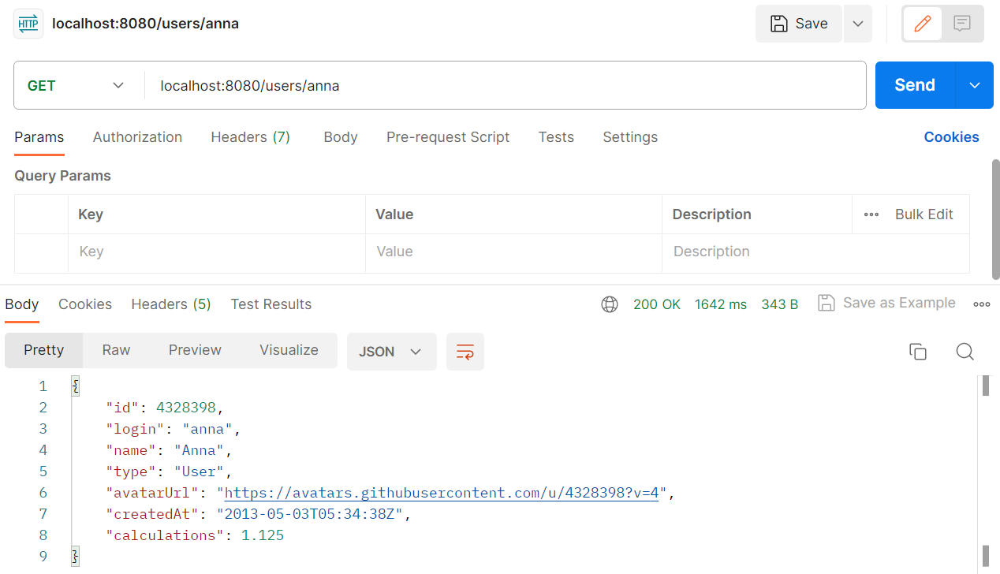
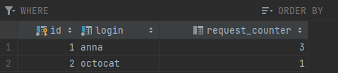

# User Info Service

Run application locally following the steps:
1. Move to root application folder and create a JAR-file by using the command below:
```
  mvn package
```
2. Start up the application by running:
``` 
  docker compose up
```

Example request and received response: 


If you want to see saved records in the database, connect to the server using URL, username and 
password defined in application.yml:
